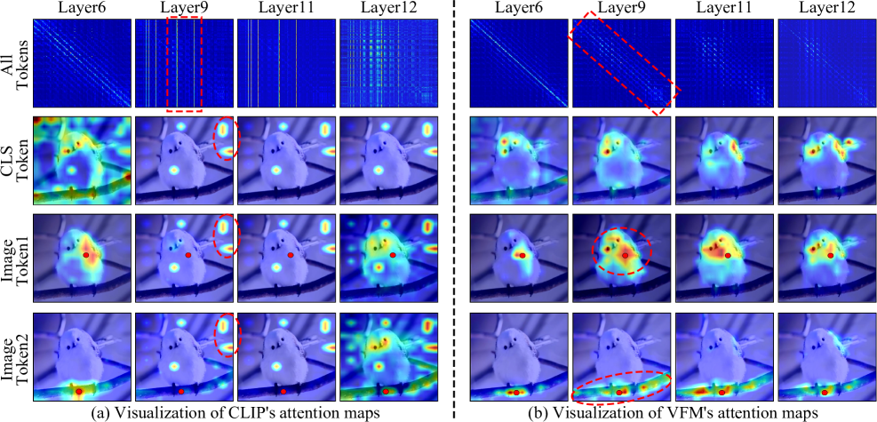
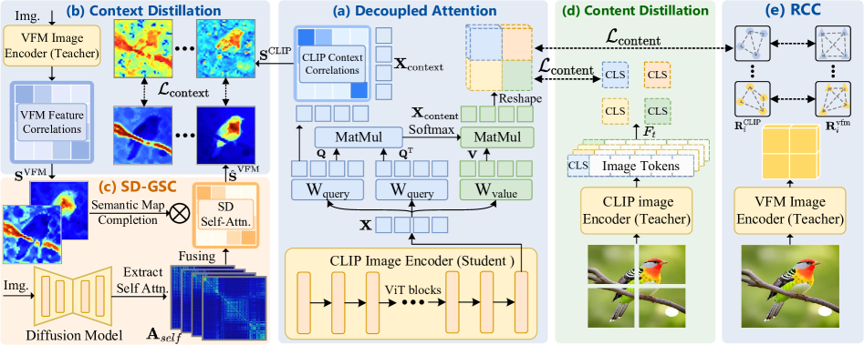
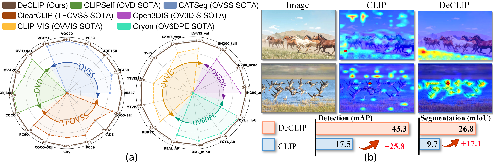

论文：Generalized Decoupled Learning for Enhancing Open-Vocabulary Dense Perception

地址：https://arxiv.org/html/2508.11256

项目：https://github.com/xiaomoguhz/DeCLIP

提出了一个名为 **DeCLIP** 的新框架，旨在提升 CLIP 在**开放词汇密集感知任务**（Open-Vocabulary Dense Perception）中的表现。

---

### 📌 背景问题
- **CLIP 在密集感知任务中表现不佳**：虽然 CLIP 在图像级任务（如分类）中表现优异，但直接应用于密集任务（如检测、分割、3D理解）时，性能显著下降。

- **原因分析**：通过对 CLIP 和 VFM（Vision Foundation Model）的注意力图进行对比分析，作者发现：
  
  - CLIP 的图像 token 在网络深层无法有效聚合语义相关区域的信息，导致局部判别性（local discriminability）差、空间一致性（spatial consistency）弱。
  - CLIP 的注意力在深层深层集中于少数“代理 token”，而非语义相关的区域。
  
  <figure style="text-align: center;">
    
    <figcaption>图1 不同层次上CLIP和VFM的注意力模式比较。在各个层次收集CLIP和VFM的注意力权重，对头部维度进行平均，并上采样到原始分辨率以便可视化。第一行展示了所有令牌的注意力权重可视化。第二、第三和第四行分别使用不同位置的[CLS]令牌和图像令牌作为查询，以示它们对其他令牌的注意力分布。选定的查询图像令牌用红点表示。我们观察到CLIP和VFM在深层注意力模式之间存在显著差异。VFM的图像令牌的注意力始终集中在语义相关的区域。相比之下，CLIP的注意力在更深层次上突然集中在几个特定的令牌上，这可能是其在密集感知任务中表现较差的主要原因。</figcaption>
  </figure>

---

### 🚀DeCLIP 框架

提出的DeCLIP是一个无监督微调框架，用于将CLIP适应开放词汇（OV）密集感知任务，如语义分割和区域分类。该框架通过解耦CLIP的自注意力机制来解决CLIP在密集感知任务中的“代理令牌”效应（即图像令牌未能有效聚合语义相关区域的信息），并利用视觉基础模型（VFM）和Stable Diffusion（SD）模型作为指导进行解耦特征增强。具体而言，DeCLIP方法分为以下几个主要模块：

1. **Decoupled Attention**：将CLIP的最后一个自注意力模块解耦成“content”特征（用于增强局部视觉-语言对齐）和“context”特征（用于增强空间一致性）。
2. **Context Distillation**：从VFM的语义亲和图中蒸馏知识，以增强CLIP的context特征，从而改善空间一致性。
3. **SD-Guided Semantic Completion (SD-GSC)**：利用SD的自注意力图来完善VFM的语义亲和图，提供更优的蒸馏信号用于context特征优化。
4. **Content Distillation**：通过自蒸馏，将CLIP的content特征中的区域表示与对应子图像的[CLS]令牌对齐，以提升局部辨别能力。
5. **Region Correlation Constraint (RCC)**：在content蒸馏过程中，使用VFM的区域相关性作为约束，防止CLIP密集特征的相关性崩溃。

这些模块通过解耦策略避免特征相关性和视觉-语言对齐之间的优化冲突，最终的总损失函数为$\mathcal{L}_{\mathrm{total}} = \mathcal{L}_{\mathrm{content}} + \lambda \mathcal{L}_{\mathrm{context}}$，其中$\mathcal{L}_{\mathrm{content}}$和$\mathcal{L}_{\mathrm{context}}$分别对应content和context的蒸馏损失。

<figure style="text-align: center;">
  
  <figcaption>图4 DeCLIP 框架的图示。(a) 解耦注意力：CLIP 的最终注意力模块被解耦为上下文特征（以增强空间一致性）和内容特征（以增强局部视觉-语言对齐）。(b) 上下文蒸馏：通过利用 VFM 中的语义亲和力图来增强上下文特征。(c) SD 引导的语义补全 (SD-GSC)：利用 SD 的自注意力图来增强 VFM 的语义亲和力图，并进一步优化上下文特征的蒸馏信号。(d) 内容蒸馏：通过将区域表示与相应的 [CLS] 令牌对齐来增强内容特征。(e) 区域相关性约束 (RCC)：使用 VFM 的区域相关性来防止内容蒸馏期间 CLIP 的密集相关性崩溃。</figcaption>
</figure>

### 🎯 方法细节

#### 1 Decoupled Attention（解耦自注意力）

将 CLIP 最后一层自注意力模块的 **输出特征** 解耦为两个部分：

- **context特征**：用于**空间一致性**（spatial consistency）
- **content特征**：用于**视觉-语言对齐**（V-L alignment）

**输入**

- $ \mathbf{X} \in \mathbb{R}^{(H \cdot W) \times C} $：最后一层注意力模块的输入

**输出**

- $\mathbf{X}_{\text{context}} \in \mathbb{R}^{H \cdot W \times C}$：用于空间一致性建模
- $\mathbf{X}_{\text{content}} \in \mathbb{R}^{H \cdot W \times C}$：用于局部语义对齐

**过程**
$$
\begin{aligned}
\mathbf{X}_{\text{context}} &= \text{Proj}_q(\mathbf{X}) \quad  \\
\mathbf{V} &= \text{Proj}_v(\mathbf{X}) \\
\text{Attn}_{\text{context}} &= \text{Softmax} \left( \frac{\mathbf{X}_{\text{context}} \mathbf{X}_{\text{context}}^\top}{\sqrt{d}} \right) \\
\mathbf{X}_{\text{content}} &= \text{Proj} \left( \text{Attn}_{\text{context}} \cdot \mathbf{V} \right)
\end{aligned}
$$

#### 2 Context Distillation（上下文蒸馏）

VFM（如 DINOv2）在深层仍能保持语义相关区域的一致性，而 CLIP 的 context 特征需要向它学习空间结构。

把 VFM 的语义亲和图（semantic affinity maps）当成教师信号，用 KL 散度迫使 CLIP context 特征产生相似的 token-to-token 相关性。

语义亲和图可以理解为一张图片所有patch之间的相似度矩阵。

**输入**

- $\mathbf{X}_{\text{dense}}^{\text{VFM}} \in \mathbb{R}^{C \times H \cdot W}$：VFM 提取的图像特征 
- $\mathbf{X}_{\text{context}} \in \mathbb{R}^{C \times H \cdot W}$：CLIP 的 context 特征

**过程**

计算语义亲和图
$$
\mathbf{S}^{\text{VFM}} = \cos\!\bigl((\mathbf{X}_{\text{dense}}^{\text{VFM}})^\top,\; \mathbf{X}_{\text{dense}}^{\text{VFM}}\bigr) \in \mathbb{R}^{H \cdot W \times H \cdot W} \\
\mathbf{S}^{\text{CLIP}} = \cos\!\bigl(\mathbf{X}_{\text{context}}^\top,\; \mathbf{X}_{\text{context}}\bigr) \in \mathbb{R}^{H \cdot W \times H \cdot W} \\
$$
KL 散度逐 token 对齐 
$$
\begin{aligned}
\mathcal{L}_{\text{context}} = \frac{1}{H \cdot W}\sum_{i=1}^{H \cdot W} \text{KL}\!\bigl(\hat{\mathbf{S}}_{i,:}^{\text{VFM}},\; \mathbf{S}_{i,:}^{\text{CLIP}}\bigr)
\end{aligned}
$$

#### 3 SD-Guided Semantic Completion（SD 引导的语义补全）

VFM 的亲和图边界模糊、内部空洞；SD 的自注意力图虽然语义区分不强，但对边界、结构敏感。

利用 **Stable Diffusion (SD)** 的自注意力图对 VFM 的语义亲和图进行补全，提升边界与结构完整性。

**输入**

- $\mathbf{A}_{\text{self}} \in \mathbb{R}^{L \times H \cdot W \times H \cdot W}$：SD 的多层、多头自注意力图。（我想知道具体是怎么提取的，但是看代码中好像没有）
- $\mathbf{S}^{\text{VFM}} \in \mathbb{R}^{H \cdot W \times H \cdot W}$：VFM 的语义亲和图

**输出**

- $\hat{\mathbf{S}}^{\text{VFM}}$：补全后的语义亲和图

**过程**

沿层/头做链式乘积，得到统一的结构注意力 
$$
\hat{\mathbf{A}}_{\text{self}} = \prod_{l=1}^{L} \mathbf{A}_{\text{self}}[l] \in \mathbb{R}^{H \cdot W \times H \cdot W} \\
$$
注意力 × 语义 
$$
\begin{aligned}
\hat{\mathbf{S}}^{\text{VFM}} &= \hat{\mathbf{A}}_{\text{self}} \cdot \mathbf{S}^{\text{VFM}}
\end{aligned}
$$
再用这增强版的语义亲和图计算损失$\mathcal{L}_{\text{context}}$。

#### 4 Content Distillation（内容蒸馏）

把原图切成若干子图，用子图的 [CLS] 作为“教师”，指导学生网络 content 特征里对应区域的特征，让局部特征也拥有同样的判别力。

**输入**

- $\mathbf{I}$：原始图像  
- $\mathbf{I}_i'$：第 $i$ 个裁剪子图  
- $\mathbf{f}_i^s \in \mathbb{R}^{N^2 \times C}$：从 content 特征中 RoI Align 提取的区域特征  
- $\mathbf{f}_i^t \in \mathbb{R}^{1 \times C}$：子图对应的 [CLS] token

$\mathbf{f}_i^s \in \mathbb{R}^{N^2 \times C}$和$\mathbf{f}_i^t \in \mathbb{R}^{1 \times C}$在空间上是对应的，可以简单理解为图像的某个子区域的特征。

**过程**

$\mathbf{f}_i^s \in \mathbb{R}^{N^2 \times C}$和$\mathbf{f}_i^t \in \mathbb{R}^{1 \times C}$的shape不一样，需要先统一再计算损失。

用余弦相似度给区域特征加权平均
$$
\bar{\mathbf{f}}_i^s = \text{softmax}\!\bigl(\cos(\mathbf{f}_i^s,\; \mathbf{f}_i^t)\bigr)^\top \cdot \mathbf{f}_i^s
$$
这时，$\bar{\mathbf{f}}_i^s$和$\mathbf{f}_i^t$相同了。然后用余弦距离对齐
$$
\mathcal{L}_{\text{content}} = \frac{1}{k}\sum_{i=1}^{k}\Bigl[1 - \cos\!\bigl(\bar{\mathbf{f}}_i^s,\; \mathbf{f}_i^t\bigr)\Bigr]
$$

#### 5 Region Correlation Constraint（区域相关性约束）

实验发现，直接对齐区域特征及其对应的[CLS]表示可能会进一步削弱CLIP密集特征的相关性。因此，在内容蒸馏过程中利用一个额外的约束项，以利用VFM的密集相关性来防止CLIP密集相关性的退化。

**输入**

- $\mathbf{f}_i^{\text{vfm}} \in \mathbb{R}^{N^2 \times D}$：VFM 对应区域特征  
- $\mathbf{f}_i^s \in \mathbb{R}^{N^2 \times C}$：CLIP 对应区域特征

**过程**

计算区域内部相关性  
$$
\mathbf{R}_i^{\text{vfm}} = \cos\!\bigl(\mathbf{f}_i^{\text{vfm}},\; (\mathbf{f}_i^{\text{vfm}})^\top\bigr), \quad
\mathbf{R}_i^{\text{CLIP}} = \cos\!\bigl(\mathbf{f}_i^s,\; (\mathbf{f}_i^s)^\top\bigr)
$$
并入原来的$\mathcal{L}_{\text{content}}$损失
$$
\mathcal{L}_{\text{content}} = \frac{1}{k}\sum_{i=1}^{k}\Bigl[1 - \cos\!\bigl(\bar{\mathbf{f}}_i^s,\; \mathbf{f}_i^t\bigr) + \text{KL}\!\bigl(\mathbf{R}_i^{\text{vfm}},\; \mathbf{R}_i^{\text{CLIP}}\bigr)\Bigr]
$$

<figure style="text-align: center;">
  
  <figcaption>图2 (a) DeCLIP与最先进方法在六个开放词汇密集感知任务中的比较。这些任务包括开放词汇检测和语义分割（OVD、OVSS）、免训练开放词汇语义分割（TFOVSS）、开放词汇3D和视频实例分割（OV3DIS、OVVIS）以及开放词汇6D姿态估计（OV6DPE）。实验证明了DeCLIP作为开放词汇密集感知的基础模型的有效性。(b) DeCLIP和CLIP之间的定量和定性比较。与CLIP相比，DeCLIP的图像tokens关注查询tokens的语义相关区域，从而显著提高密集感知性能。查询tokens用红点突出显示。</figcaption>
</figure>

### 🧪 实验验证

DeCLIP 在多个任务和数据集上显著优于 CLIP 和其他 SOTA 方法：

| 任务类型 | 代表任务 | 提升示例 |
|---|---|---|
| **2D 检测/分割** | OV-COCO、OV-LVIS | 在 OV-COCO 上提升 5.7~8.1 mAP |
| **3D 实例分割** | ScanNet200 | 提升 Open3DIS 的 AP 从 21.8 → 27.7 |
| **视频实例分割** | YTVIS21、OVIS 等 | 提升 CLIP-VIS 的 AP 从 18.5 → 22.2 |
| **6D 姿态估计** | REAL275、TOYL | 提升 AR 指标 2.3~5.4 |
| **训练无关分割** | VOC、ADE20K、Cityscapes | 平均 mIoU 达到 44.1，超越所有现有方法 |

---

### 🧩 总结
DeCLIP 是一个**无需额外标注、统一架构**的 CLIP 增强框架，通过**解耦学习策略**有效提升了其在开放词汇密集感知任务中的泛化能力，适用于 2D、3D、视频等多种模态。
