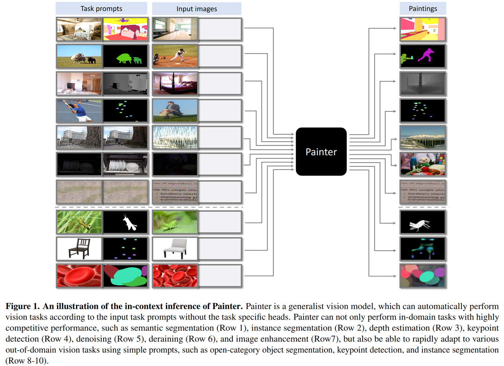

论文：[Images Speak in Images: A Generalist Painter for In-Context Visual Learning](https://arxiv.org/abs/2212.02499)

代码：https://github.com/baaivision/Painter

简介：

- 把语义分割、实例分割、深度估计、关键点检测等视觉任务统一到同一框架（Painter）里，也即同一个网络结构就可以完成这些不同的任务。Painter，能把图片mask掉的区域“画”出来。
- 利用prompts提示模型在以上不同任务中切换，prompts是图片（不是文本）。

---

下图展示了多种视觉任务通过同一个Painter实现预测的过程。

Task prompts是“提示词”，（以语义分割为例）由一张图片和对应的语义分割标签组成；Input images也是两张图，一张待分割的图和一张空白图；模型一边看着提示词，一边看着待分割的图，推测空白处应该画成什么样，也即语义分割结果。

所以，在推理阶段，模型的输入是4张图，输出是1张图，其中，空白图并不是真的图，而是可以学习的embedding。

---

模型是怎么训练的呢？

- 一个训练样本是4张图，（还是以语义分割为例）两张照片和两张GT（ground truth），两张照片上下拼接成一张图，GT也一样，4张图就变成了2张。
- 模型输入有两个分支，一个分支输入照片，一个分支输入GT。
- GT会被随机masked一些块，让模型预测，然后跟ground truth做对比，计算损失，达到训练模型的目的。

---

网络结构并不复杂，论文给图，在代码里搜索`class Painter`就能找到它。