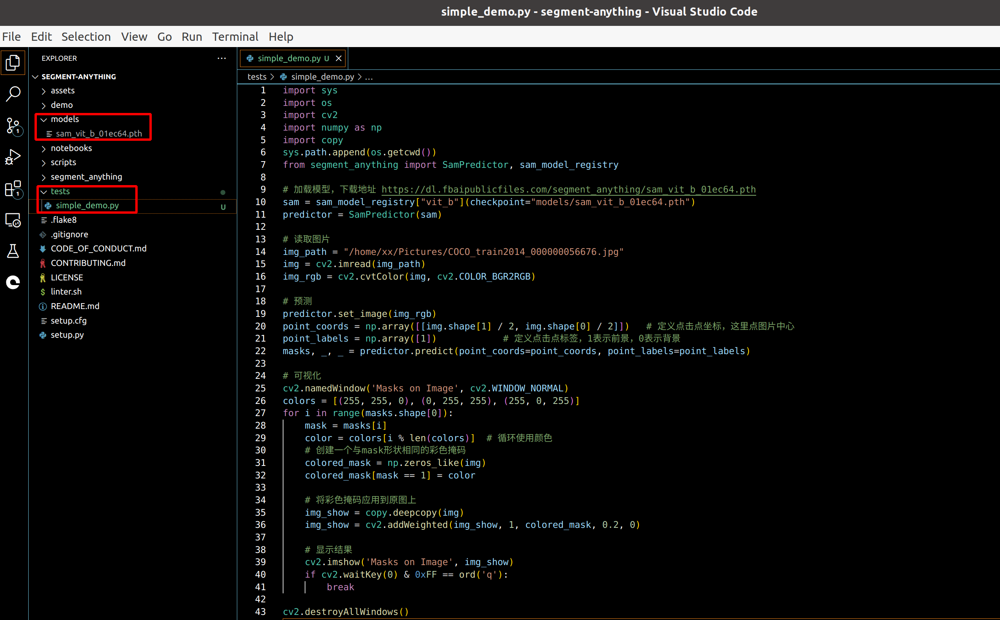
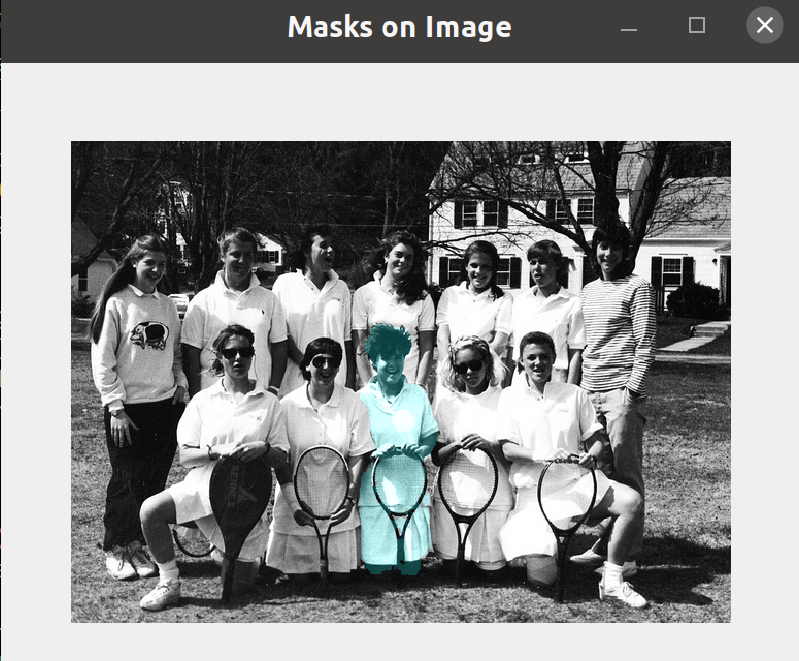
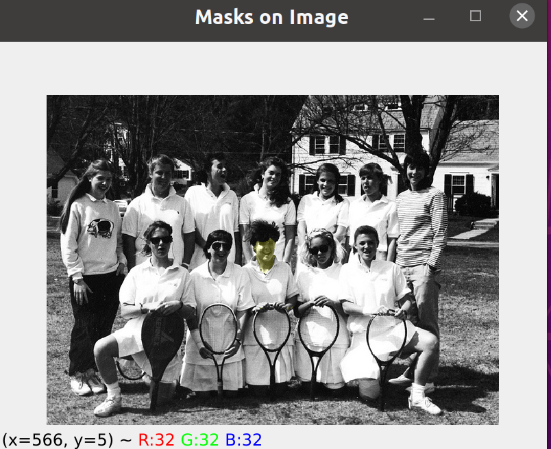

# Segment Anything Model（SAM）极简代码实践



1、github下载代码安装

```Python
git clone git@github.com:facebookresearch/segment-anything.git
cd segment-anything; pip install -e .
```

2、下载模型

这是最小的模型：

https://dl.fbaipublicfiles.com/segment_anything/sam_vit_b_01ec64.pth

3、复制粘贴代码

在`segment-anything`目录下创建一个py文件，比如`tests/simpe_demo.py`，把下面的代码贴上去。

```Python
import sys
import os
import cv2
import numpy as np
import copy
sys.path.append(os.getcwd())
from segment_anything import SamPredictor, sam_model_registry

# 加载模型，下载地址 https://dl.fbaipublicfiles.com/segment_anything/sam_vit_b_01ec64.pth
sam = sam_model_registry["vit_b"](checkpoint="models/sam_vit_b_01ec64.pth")
predictor = SamPredictor(sam)

# 读取图片
img_path = "/home/xx/Pictures/COCO_train2014_000000056676.jpg"
img = cv2.imread(img_path)
img_rgb = cv2.cvtColor(img, cv2.COLOR_BGR2RGB)

# 预测
predictor.set_image(img_rgb)
point_coords = np.array([[img.shape[1] / 2, img.shape[0] / 2]])   # 定义点击点坐标，这里点图片中心
point_labels = np.array([1])            # 定义点击点标签，1表示前景，0表示背景
masks, _, _ = predictor.predict(point_coords=point_coords, point_labels=point_labels)

# 可视化
cv2.namedWindow('Masks on Image', cv2.WINDOW_NORMAL)
colors = [(255, 255, 0), (0, 255, 255), (255, 0, 255)]
for i in range(masks.shape[0]):
    mask = masks[i]
    color = colors[i % len(colors)]  # 循环使用颜色
    # 创建一个与mask形状相同的彩色掩码
    colored_mask = np.zeros_like(img)
    colored_mask[mask == 1] = color
    
    # 将彩色掩码应用到原图上
    img_show = copy.deepcopy(img)
    img_show = cv2.addWeighted(img_show, 1, colored_mask, 0.2, 0)

    # 显示结果
    cv2.imshow('Masks on Image', img_show)
    if cv2.waitKey(0) & 0xFF == ord('q'):
        break

cv2.destroyAllWindows()
```

4、修改一下路径

包括模型路径和图片路径

5、运行代码

python3 tests/simpe_demo.py

6、结果可视化

如果顺利，会显示一张图，图上绘制了mask。

键盘输入n，就会显示下一张，一共会显示3张，因为输出了3个masks，覆盖范围由大到小。




