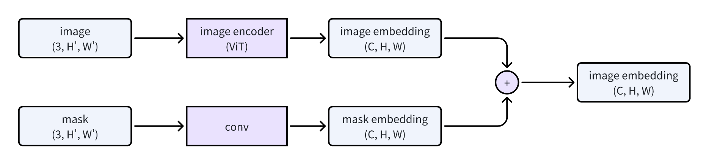
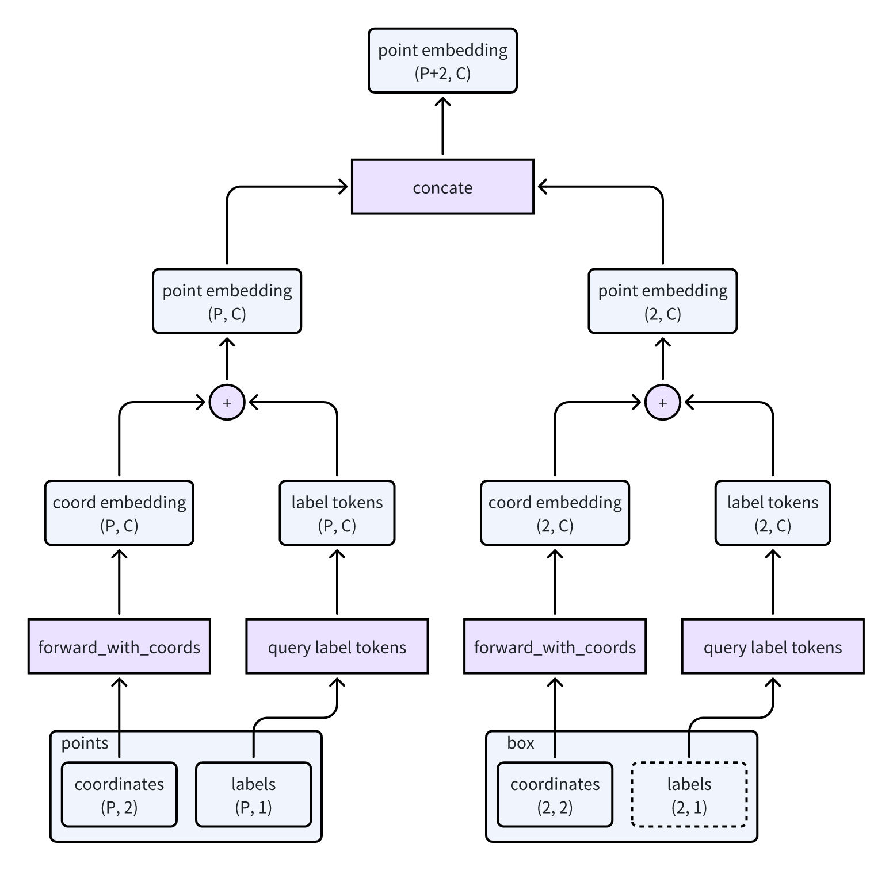
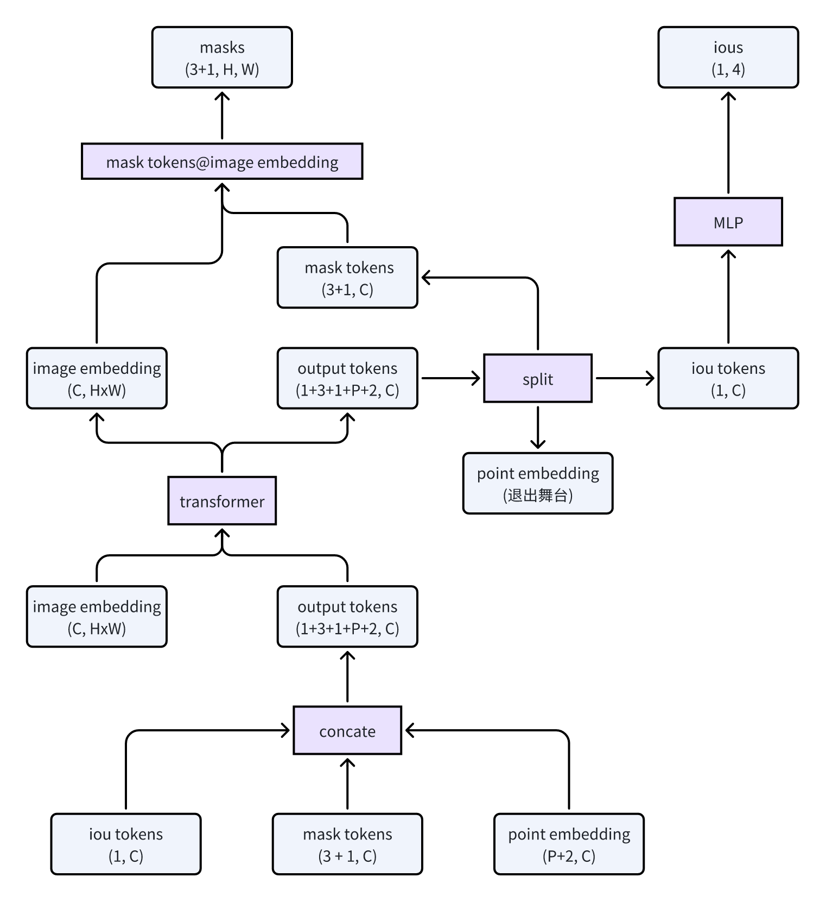

# Segment Anything Model（SAM）极简代码实践


1、github下载代码安装

```Python
git clone git@github.com:facebookresearch/segment-anything.git
cd segment-anything; pip install -e .
```

2、下载模型

这是最小的模型：

https://dl.fbaipublicfiles.com/segment_anything/sam_vit_b_01ec64.pth

3、复制粘贴代码

在`segment-anything`目录下创建一个py文件，比如`tests/simpe_demo.py`，把下面的代码贴上去。

```Python
import sys
import os
import cv2
import numpy as np
import copy
sys.path.append(os.getcwd())
from segment_anything import SamPredictor, sam_model_registry

# 加载模型，下载地址 https://dl.fbaipublicfiles.com/segment_anything/sam_vit_b_01ec64.pth
sam = sam_model_registry["vit_b"](checkpoint="models/sam_vit_b_01ec64.pth")
predictor = SamPredictor(sam)

# 读取图片
img_path = "/home/xx/Pictures/COCO_train2014_000000056676.jpg"
img = cv2.imread(img_path)
img_rgb = cv2.cvtColor(img, cv2.COLOR_BGR2RGB)

# 预测
predictor.set_image(img_rgb)
point_coords = np.array([[img.shape[1] / 2, img.shape[0] / 2]])   # 定义点击点坐标，这里点图片中心
point_labels = np.array([1])            # 定义点击点标签，1表示前景，0表示背景
masks, _, _ = predictor.predict(point_coords=point_coords, point_labels=point_labels)

# 可视化
cv2.namedWindow('Masks on Image', cv2.WINDOW_NORMAL)
colors = [(255, 255, 0), (0, 255, 255), (255, 0, 255)]
for i in range(masks.shape[0]):
    mask = masks[i]
    color = colors[i % len(colors)]  # 循环使用颜色
    # 创建一个与mask形状相同的彩色掩码
    colored_mask = np.zeros_like(img)
    colored_mask[mask == 1] = color
    
    # 将彩色掩码应用到原图上
    img_show = copy.deepcopy(img)
    img_show = cv2.addWeighted(img_show, 1, colored_mask, 0.2, 0)

    # 显示结果
    cv2.imshow('Masks on Image', img_show)
    if cv2.waitKey(0) & 0xFF == ord('q'):
        break

cv2.destroyAllWindows()
```

4、修改一下路径

包括模型路径和图片路径

5、运行代码

python3 tests/simpe_demo.py

6、结果可视化

如果顺利，会显示一张图，图上绘制了mask。

键盘输入n，就会显示下一张，一共会显示3张，因为输出了3个masks，覆盖范围由大到小。


---

# SAM模型结构介绍

下面结合SAM的论文和代码梳理一下SAM的结构，个人觉得论文中关于模型的图解过于简洁，很难深入理解它是怎么能work的。

所以研究了一下源码，还好不是很复杂，总算是大概理清了来龙去脉，并且画了几个流程图。不过只是推理阶段的流程，因为没有训练的代码。

---

论文开篇就是这张图：


简单解释一下：

（a）提出了一种新的视觉任务，通过prompt引导模型分割图像，prompt的形式有4种：point、box、mask和text。但开源的代码中缺少text部分。

（b）模型整体由3部分组成，prompt encoder对prompt进行编码，image encoder对图片进行编码，lightweight mask decoder融合prompt和image的编码，生成分割masks。

（c）为了快速标注数据训练模型而提出的辅助图片标注的流程。

---

下面这张图对模型进行更具体的展开，


从中可以看出几点：

- image encoder对image进行编码，得到image embedding。
- Conv对mask进行编码，再和image embedding相加。
- points、box和text经过prompt encoder编码，再与image embedding融合，最后输出多个masks。

但是还不够详细，本人对流程中Tensor的shape的变化过程有墙裂的求知欲。

image encoder和conv还好理解一些，图像特征提取那一套，都是（B, C, H, W）进(B, C', H', W')出。

prompt encoder和mask decoder就没那么容易想象，看论文也没看懂，于是看源代码。

根据对代码的理解，画出下面几个图。

---

image经过ViT编码，mask经过conv编码，得到shape相同的embedding，然后相加。

为了方便理解（偷懒），下面画的图都把batch size默认为1，省略掉1维。



---

points和box两种prompts都统一成points的形式，因为box（矩形）可以用左上角和右下角两个点表示。

points分正样本（前景）和负样本（背景）两类，所以一个point prompt不仅有坐标coordinate，还有标签label。

同样，box的两个点也有labels，区分哪个是左上角哪个是右下角，同时也能跟points区分开来。

如此一来，points和box都可以统一由坐标（coordinates）和标签（labels）表示，于是就可以用同一个网络对它们进行编码（尽管我画成了两个分支，但其实模型参数是共享的）。

points可以有多个，所以coordinates.shape=(P, 2)，对应的labels.shape=(P, 1)。

box按理说只需要一个，所以coordinates.shape=(2, 2)，对应的labels.shape=(2, 1)。

coordinates经过一顿处理，变成了shape=(P, C)的coord embedding，可以简单理解为经过一个Linear层，提升了维度。

labels不直接输入模型计算，而是用对应的tokens，一个token是一个长度为C的向量，所以tokens.shape=(P, C)。

然后，coord embedding和label tokens相加，得到的结果称之为point embedding吧。

然后，points和box得到的point embedding拼接成新的point embedding，shape=(P+2, C)。

到此，points和box的编码阶段就结束啦。



---

前面两张流程图描述了image embedding和point embedding的生成流程，接下来介绍这两者的融合过程，也就是mask decoder。

这里突然冒出了iou tokens和mask tokens。

先说mask tokens，类似目标检测DETR里面的anchors，输入一个query得到一个output，这里输入一个mask token就得到一个分割mask。

这里用了3+1个mask tokens，3对应着论文中所说的整体、部分和子部分（whole, part, and subpart），论文中Figure4的剪刀就说明了这一点，即一个prompt可以让模型分割出三个masks。

如果不想要那么多个模棱两可的输出，而是要更加坚定的唯一结果，那就不用这3个mask tokens，用剩下的那个mask token。

再就是iou tokens，如果说mask tokens是用来查询masks的，那么iou tokens就是用来查询masks的置信度的，或者说是分割的质量。类似目标检测里bounding box和score的关系。

mask tokens和iou tokens会和前面介绍的point embedding拼接在一起，统称为output tokens。

output tokens和image embedding被送进transformer做融合，输出的结果的shape和输入时是一样的，只是经过交融后达到了你中有我和我中有你的状态，至于交融的过程这里就不展开了。

到这里，masks已经呼之欲出了。

还记得output tokens是由iou tokens、mask tokens和point embedding三部分组成的吗？现在要把它们也拆分成三部分。

其中，mask tokens和image embedding进行矩阵相乘，直接得到最终的masks。

iou tokens经过一个MLP，也直接得到4个masks的置信度。



至此，介绍完了。