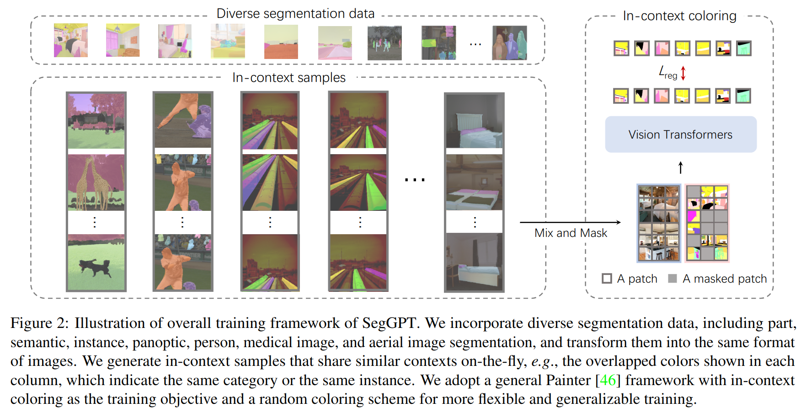

## SegGPT: Segmenting Everything In Context

论文地址：https://arxiv.org/abs/2304.03284

源码地址：https://github.com/baaivision/Painter

简简介：以图片为提示词（prompt）的语义、实例分割模型，不限于固定的类别

---

Figure 1展示基于prompt分割的多个样例。

橙色边框的图展示了prompt和对应的mask。

蓝色边框的图展示了input和预测的mask，input是需要被分割的图。

模型要做的事情就是：已知prompt image、prompt mask和input image，求input mask。

注意，图中的文字并不是prompt，而是写给读者看的，为了方便理解mask的意图。

---

Figure2展示了数据准备和模型训练过程。

训练集汇聚了语义分割、实例分割、全景分割、人像分割、医疗影像、航拍等场景的图片。

生成上下文相似的图片组合，主要为了得到prompt和input，比如同一张图任意裁剪出两块，一块做prompt，另一块做input。

**训练**

prompt、prompt_mask、input和input_mask共4张图一起进入模型，从图中可以看出，训练阶段并不区分哪张图是prompt、哪张图是input，而是在更细的粒度（patch）上区分，彩色块对应prompt，灰色块对应input。

既然模型根据prompt执行分割任务，那么模型应该有两个数据入口，一个喂input，一个喂prompt，类似Segment Anything Model那样，但事实上并没有那么复杂。

模型就只是一个沙漏型的结构，两头大中间小，一个入口，一个出口，理论上用一个卷积网络也能做这个事情。

如果真的那么简单，模型怎么区分哪个是prompt、哪个是input、哪个是prompt mask？

一个训练样本有4张图，其中两张是prompt和input，上下拼接起来变成一张图，shape=(896, 448, 3)，prompt mask和input mask也同样拼接起来，这样就得到两张shape=(896, 448, 3)的图（且称之为image和mask），如Figure2所示。

刚才通过拼接把4张图变2张图了，接下来是不是把2张图左右拼接变成1张图，再输入到模型呢？

并不是，image和mask直接叠成一个小batch，shape=(2, 896, 448, 3)，看起来很奇怪，让人不禁疑惑。

怎么区分image和mask？image和mask如果各行其道，模型怎么知道它俩是一起的？

首先，image和mask只是暂时分开，经过几层后就合并了。假设batch size=4，刚开始输入shape=(4x2, 3, H, W)，经过几层后就变成了(4, C, H, W)，因为相邻的两个样本取均值合并了。另外，要区分image和mask，只要给它们加上一个可学习的tokens就可以了（transformer的常规操作了）。

最后，模型预测的mask的shape=(896, 448, 3)，将预测值和真值对比求损失。