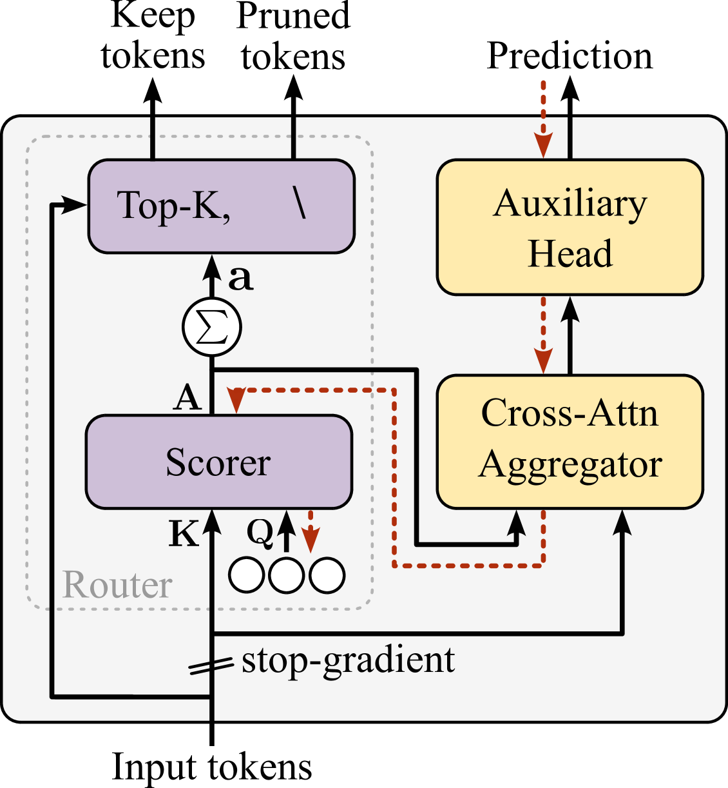
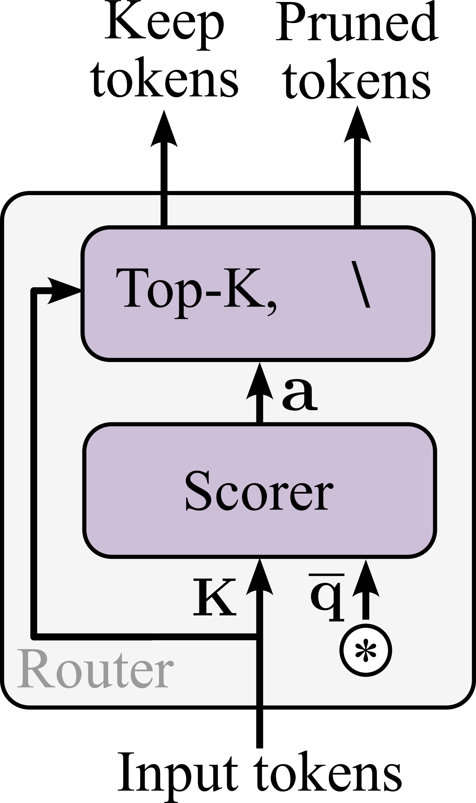
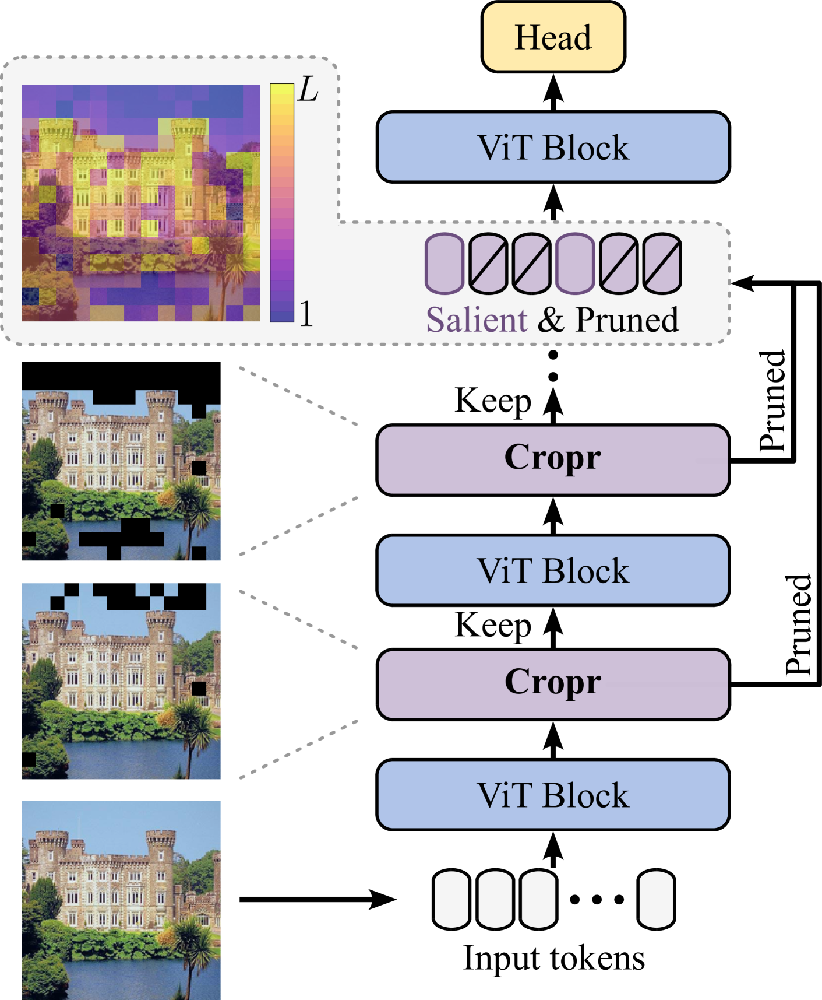

论文：[Token Cropr: Faster ViTs for Quite a Few Tasks](https://arxiv.org/abs/2412.00965)

代码：https://github.com/benbergner/cropr

简介：

更快的ViTs（Vision Transformers），有多快？1.5到4倍速。

怎么实现的？裁剪tokens。

tokens是啥？指的是Transformer模型中流动的数据序列。

tokens裁剪就是把序列剪短。

怎么剪短？Token Cropr的全称是Token **Cro**ss-attention **pr**uning (**Cropr**)，意思是通过交叉注意力模块剪枝。

剪枝的思路是什么？对任务更加有用的留下，没用的剪掉。比如分类任务，图片的背景对分类准确度的影响不大，其实可以不看。

怎么评估哪个tokens更加有用？用一个打分器（scorer）评估每个tokens的重要性，如下图所示。

scorer是怎么评分的？scorer是一个矩阵相乘操作（QxK逆），就是交叉注意力中的那个QxK逆，这样就得到一个权重矩阵A 。

Q和K是什么？K是由输入tokens变换得到，shape=(M, D)，M就是序列的长度。Q是scorer中需要学习的参数，它学好了就能选出重要的tokens，shape=(N, D)，这个N可大可小，取1以上就行。

A的维度为NxM，对A沿维度0求和得到长度为M的权重向量a，根据a就可以对输入tokens进行排序了，选出Top-K进入更深层的网络，剩下的M-K个tokens被剪掉。

scorer评分的关键在于Q，它怎么知道哪个tokens重要，哪个不重要？这就要引入辅助头了，上图的黄色部分。

这个辅助头是什么？以分类任务为例，它就是一个预测图片class的分类器，只不过它并不是模型最后一个分类器，而是在中间分叉出来的。它是用来训练scorer的Q的。

辅助头是怎么训练Q的？大致过程就是，根据Q和K计算出来的A，对输入tokens进行加权聚合（Cross-Attn Aggregator），聚合后的特征用来做分类。如果Q是训练有效的，那么经过它算出来的A对tokens的加权聚合应该是能保留重要特征的，那么辅助头的预测结果也会更好；反之则不好。通过这样的方式就可以训练Q的参数啦。

scorer就这样被训练出来啦。

推理阶段辅助头就不需要了，Cross-Attn Aggregator也不需要了，如下图所示。

对于一些密集的预测任务，比如语义分割，需要保持一个“方方正正”的输出，如果tokens被剪掉了，就相当于图片的一些像素块被丢掉了，要找些什么来填补一下，填0也行，不能什么都没有。

论文的做法是把前面剪掉的tokens在最后一个block填回来。

