# Revisiting Weak-to-Strong Consistency in Semi-Supervised Semantic Segmentation

## 论文信息

- **标题**: Revisiting Weak-to-Strong Consistency in Semi-Supervised Semantic Segmentation
- **作者**: Lihe Yang¹, Lei Qi², Litong Feng³, Wayne Zhang³, Yinghuan Shi¹ 
- **机构**: 
  - ¹ 南京大学 (Nanjing University)
  - ² 东南大学 (Southeast University)
  - ³ 商汤研究院 (SenseTime Research)
- **代码**: https://github.com/LiheYoung/UniMatch
- **会议**: CVPR 2023

## 简介

标题解读：重新审视半监督语义分割中的弱到强一致性。

弱到强一致性（Weak-to-Strong Consistency）是什么呢？

核心思路：对一个没有标签的样本做**弱增强**和**强增强**，模型预测弱增强得到的样本的标签，用这个标签+强增强样本训练模型。

弱增强：只做轻微变换（如小范围裁剪、水平翻转），图像和标签分布变化不大，模型容易预测得比较准。

强增强：做更剧烈的变换（如颜色抖动、CutMix、强裁剪等），图像变化大，模型更难预测，但能学到更鲁棒的特征。

弱到强一致性框架由半监督分类中的 FixMatch 推广而来，作者观察到当这种简单的流程迁移到分割场景时，也能取得很好的结果。然而，其成功很大程度上依赖于手动设计的强数据增强，所以作者想从模型的层面优化一下。

因此，除了在图像上做增强，作者还在特征上做扰动（如通道 dropout），多了一条「特征被扰动后再预测」的支路，让模型在更多样的输入下都保持一致。同时，对同一张图做两次不同的强增强得到两个版本，都用「弱增强版本」的预测当伪标签来监督，相当于一次训练里多利用了一倍强增强。

UniMatch 在 Pascal、Cityscapes、COCO 上均达到 SOTA，在遥感和医学图像分割上同样表现突出。

## 1. 引言

语义分割旨在为图像提供像素级预测，可以视为密集分类任务，是自动驾驶等实际应用的基础。然而，传统的全监督场景极度依赖人工标注者精心标注的图像，这极大地阻碍了其在某些标注成本高昂甚至不可行的领域的广泛应用。因此，半监督语义分割被提出并受到越来越多的关注。

### 1.1 研究背景

半监督语义分割方法已经从基于 GAN 的对抗训练范式演变为广泛采用的一致性正则化框架和重生的自训练流程。本文专注于**弱到强**一致性正则化框架，该框架由 FixMatch 从半监督分类领域推广，然后影响了许多其他相关任务。

弱到强方法用弱扰动版本 $x^w$ 的预测来监督强扰动版本 $x^s$。之所以有效：弱视图上预测更准、适合当伪标签；强视图上输入更难、模型不能只背答案，得学更稳的特征，同时也不容易对错误预测越陷越深（确认偏差）。

### 1.2 主要发现

作者发现，只要配合适当的强扰动，FixMatch 在分割场景中确实仍能展现出强大的泛化能力，获得了优于最先进（SOTA）方法的结果。

通过研究图像级强扰动，作者观察到它们在使 FixMatch 成为半监督语义分割中强大竞争者方面发挥着不可或缺的作用。性能差距极其巨大。

  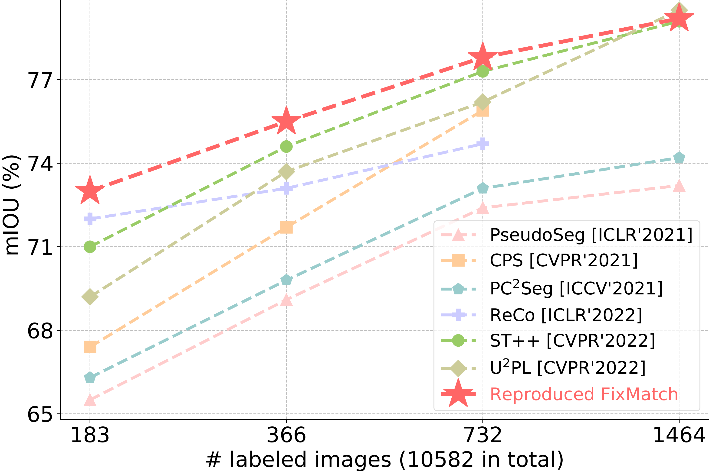

<i>图1：复现的 FixMatch 与现有 SOTA 方法在 Pascal 数据集上的对比。</i>

### 1.3 方法动机

作者从两个方向加强扰动：

1. **不只扰动图像，也扰动特征**：原来只在输入图像上做颜色抖动、CutMix 等，都在「图像级」。作者再加一条支路：在网络中间特征上做扰动（如通道 dropout），让模型在「特征被搞乱一点」时也要预测对，相当于多一种扰动方式。

2. **一张图做两次强增强，而不是一次**：FixMatch 里每张未标注图只做一次强增强、得到一个强视图。作者改成做两次，得到两个强视图，都用同一张弱视图的预测来监督，相当于把已有的强增强多利用一倍。

### 1.4 主要贡献

1. 作者注意到，配合适当的图像级强扰动，FixMatch 在迁移到语义分割场景时仍然是一个强大的框架。简单复现的 FixMatch 在分割任务中优于几乎所有现有方法。

2. 基于 FixMatch，作者提出了一个统一扰动框架，将图像级和特征级扰动统一到独立流中，以利用更广泛的扰动空间。

3. 作者设计了双流扰动策略，以充分探索预定义的图像级扰动空间，并收获对比学习在判别表示方面的优势。

4. 集成上述两个组件的框架在 Pascal、Cityscapes 和 COCO 的所有评估协议中都显著超越了现有方法。值得注意的是，它还在医学图像分析和遥感解释中展现出强大的优越性。

## 2. 方法

### 2.1 预备知识

FixMatch 利用弱到强一致性正则化来利用未标注数据。具体来说，每个未标注图像 $x^u$ 同时被两个操作符扰动，即弱扰动 $\mathcal{A}^w$（如裁剪）和强扰动 $\mathcal{A}^s$（如颜色抖动）。

整体目标函数是监督损失 $\mathcal{L}_s$ 和无监督损失 $\mathcal{L}_u$ 的组合：

$$\mathcal{L} = \frac{1}{2}(\mathcal{L}_s + \mathcal{L}_u)$$

通常，监督项 $\mathcal{L}_s$ 是模型预测和真实标签之间的交叉熵损失。无监督损失 $\mathcal{L}_u$ 用损失项约束：强视图上的预测要接近弱视图上的预测，可以表述为：

$$\mathcal{L}_u = \frac{1}{B_u}\sum \mathbf{1}(\max(p^w) \geq \tau)\mathrm{H}(p^w, p^s)$$

其中 $B_u$ 是未标注数据的批次大小，$\tau$ 是预定义的置信度阈值，用于过滤噪声标签。$\mathrm{H}$ 最小化两个概率分布之间的熵：

$$p^w = \hat{F}(\mathcal{A}^w(x^u)); \quad p^s = F(\mathcal{A}^s(\mathcal{A}^w(x^u)))$$

其中教师模型 $\hat{F}$ 在弱扰动图像上产生伪标签，而学生 $F$ 利用强扰动图像进行模型优化。在本文中，作者将 $\hat{F}$ 设置为与 $F$ 完全相同，遵循 FixMatch 的做法。

### 2.2 图像和特征的统一扰动（UniPerb）

尽管 FixMatch 的方法论在多个研究主题中取得了成功，但其有效性实际上严重依赖于研究人员精心设计的强扰动，其最优组合和超参数获取耗时。更重要的是，它们完全限制在图像级别，阻碍了学生模型在更多样化扰动下保持多级一致性。

除了在图像上做强增强，作者还多加了一条支路：对弱增强图 $x^w$ 提完特征后，在特征上做扰动（如通道 dropout），再预测。图像扰动一条支路、特征扰动一条支路，分开算损失、各自用弱视图的预测来监督，不混在一个前向里。

形式上，分割模型 $f$ 可以分解为编码器 $g$ 和解码器 $h$。除了 FixMatch 中获得的 $p^w$ 和 $p^s$，作者还通过以下方式从辅助特征扰动流获得 $p^{fp}$：

$$e^w = g(x^w)$$

$$p^{fp} = h(\mathcal{P}(e^w))$$

其中 $e^w$ 是 $x^w$ 的提取特征，$\mathcal{P}$ 表示特征扰动，例如 dropout 或添加均匀噪声。

总体而言，对于每个未标注 mini-batch，维护三个前向流：
1. 最简单的流：$x^w \rightarrow f \rightarrow p^w$
2. 图像级强扰动流：$x^s \rightarrow f \rightarrow p^s$
3. 引入的特征扰动流：$x^w \rightarrow g \rightarrow \mathcal{P} \rightarrow h \rightarrow p^{fp}$

这样，学生模型被强制在图像和特征级别对统一扰动保持一致。作者将其命名为 UniPerb。无监督损失 $\mathcal{L}_u$ 表述为：

$$\mathcal{L}_u = \frac{1}{B_u}\sum \mathbf{1}(\max(p^w) \geq \tau)\big(\mathrm{H}(p^w, p^s) + \mathrm{H}(p^w, p^{fp})\big)$$

应该注意的是，作者并不旨在提出一种新颖的特征扰动方法。实际上，一个极其简单的通道 dropout（PyTorch 中的 `nn.Dropout2d`）已经表现足够好。

### 2.3 双流扰动（DusPerb）

图像级强扰动效果很好，作者想「吃透」它们。自监督/半监督里已有做法——例如 SwAV 的 multi-crop、ReMixMatch 对未标注数据做多个强增强版本——说明多视图能更好利用扰动，所以作者在分割里也试了类似思路。

FixMatch 里每张未标注图只做一次强增强，得到一个强视图 $x^s$。DusPerb 改成：对同一张弱增强图 $x^w$，用强扰动池 $\mathcal{A}^s$ **独立做两次**强增强，得到两个强视图 $x^{s_1}$、$x^{s_2}$（因为 $\mathcal{A}^s$ 带随机性，两次结果不同）。训练时这两个强视图都用**同一个**弱视图的预测 $p^w$ 当伪标签来监督。

只多了「每张图多做一次强增强、多一条监督」这一改动，在所有标注划分设定下都稳定超过原始 FixMatch，达到新的 SOTA。消融表明提升主要来自「双强视图」本身，而不是单纯把未标注 batch 变大。

用同一个弱视图去约束两个强视图，等价于在间接约束「两个强视图的预测要一致」。从特征角度看：记弱视图预测的那一类在分类头里的权重为 $k_w$，两个强视图在分类头前的特征为 $q_{s_1}$、$q_{s_2}$。交叉熵损失要求两个强视图的 logit 在「弱视图预测类」$k_w$ 上都要高（即对 $j=s_1,s_2$ 都最大化 $q_j\cdot k_w$），相当于把 $q_{s_1}$、$q_{s_2}$ 都往 $k_w$ 拉，于是 $q_{s_1}$ 和 $q_{s_2}$ 也会被拉近——等价于在隐式地做对比：正对是 $(q_{s_1}, q_{s_2})$，负样本可视为其他类的权重 $k_i$。因此和对比学习（InfoNCE）的精神一致，对应形式为：

$$\mathcal{L}_{s_1\leftrightarrow s_2} = -\log\frac{\exp(q_{s_1}\cdot q_{s_2} )}{\sum_{i=0}^{C}\exp(q_j \cdot k_i)}, \quad j \in \{s_1, s_2\}$$

式中：分子是正对 $(q_{s_1}, q_{s_2})$ 的相似度，分母对**所有类别** $i$ 求和（$\sum_{i=0}^C$），负样本即除 $k_w$ 外的各类权重 $k_i$。

  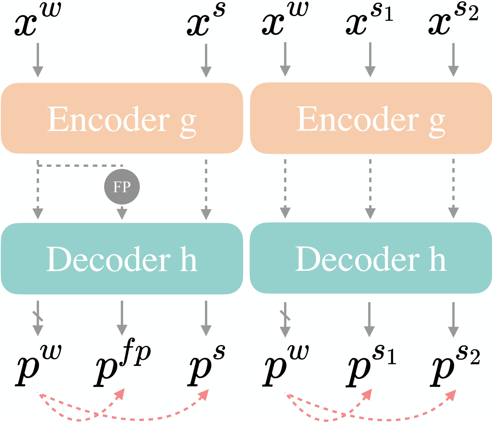

<i>图2：集成到 UniMatch 中的两个子框架：UniPerb（图像与特征统一扰动）与 DusPerb（双流图像扰动）。FP 表示特征扰动。</i>

### 2.4 整体框架：UniMatch

总结来说，作者提出了两个关键技术来利用未标注图像，即 UniPerb 和 DusPerb。集成两种方法的整体框架（称为 UniMatch）如图所示。

  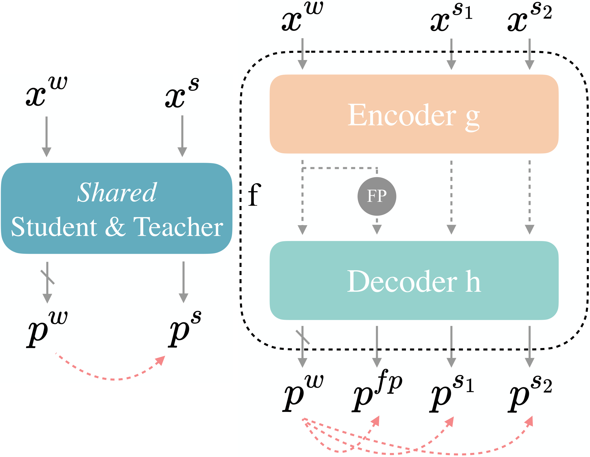

<i>图3：(a) FixMatch 基线；(b) 本文提出的统一双流扰动方法 UniMatch。灰色 FP 表示特征扰动，粉色虚线表示监督关系。</i>

与 FixMatch 相比，维护了两个辅助前向流：一个用于 $x^w$ 的特征扰动，另一个用于 ($x^{s_1}$, $x^{s_2}$) 的多视图学习。最终的无监督项计算为：

$$\mathcal{L}_u = \frac{1}{B_u}\sum \mathbf{1}(\max(p^w) \geq \tau)\cdot \big(\lambda\mathrm{H}(p^w, p^{fp}) + \frac{\mu}{2}\big(\mathrm{H}(p^w, p^{s_1}) + \mathrm{H}(p^w, p^{s_2})\big)\big)$$

需要说明的是，特征级和图像级扰动流具有各自的属性和优势，因此它们的损失权重 $\lambda$ 和 $\mu$ 均设置为 0.5。$\mathcal{L}_u$ 中的 $\mathrm{H}$ 是常规交叉熵损失。置信度阈值 $\tau$ 对于除 Cityscapes 外的所有数据集设置为 0.95，在 Cityscapes 上 $\tau$ 为 0。

## 3. 实验

### 3.1 实现细节

为了与先前工作公平比较，作者主要采用基于 ResNet 的 DeepLabv3+ 作为分割模型。ResNet 在所有实验中使用输出步长为 16 以节省内存并加速训练。

训练期间，每个 mini-batch 由 8 个标注图像和 8 个未标注图像组成。初始学习率对于 Pascal、Cityscapes 和 COCO 分别设置为 0.001、0.005 和 0.004，使用 SGD 优化器。模型在 poly 学习率调度器下训练 80、240 和 30 个 epoch。

作者将 ST++ 的颜色变换和 CutMix 组合形成 $\mathcal{A}^s$。原始图像在 0.5 和 2.0 之间调整大小、裁剪和翻转以获得其弱增强版本 $x^w$。训练分辨率对于这三个数据集分别设置为 321、801 和 513。

默认情况下，作者采用 50% 概率的通道 dropout（PyTorch 中的 `nn.Dropout2d(0.5)`）作为特征扰动，插入在编码器和解码器的交汇处。

### 3.2 与最先进方法的比较

#### Pascal VOC 2012

Pascal 数据集最初由 1464 张高质量训练图像构建。后来，通过 SBD 的额外粗标注扩展，得到 10582 张训练图像。有三种选择标注图像的协议：
1. 从原始高质量训练图像中选择（最有说服力的）
2. 从混合的 10582 张训练图像中选择
3. 优先选择高质量集，如果不够，从扩展集中选择

在第一个协议下，UniMatch 显著优于现有方法。作者甚至采用了比大多数最近工作的 512 更小的训练尺寸 321。此外，对于其他两个协议，作者在两个分辨率 321 和 513 下训练 UniMatch。它仍然获得了对先前工作的显著改进。

  

<i>表1：Pascal VOC 2012 原始协议（从 1464 张高质量训练图中选取标注）下的 mIoU 结果。</i>

  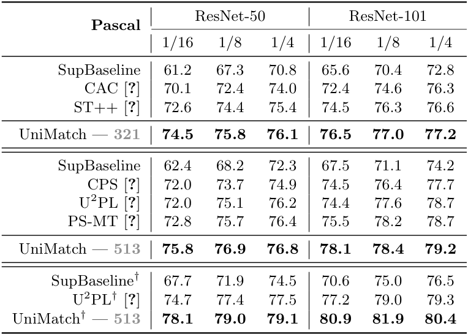

<i>表2：Pascal VOC 2012 两种标注协议、两种训练分辨率（321 / 513）下的结果。</i>

#### Cityscapes

该数据集专注于城市场景，由 2975 张高分辨率训练图像和 500 张验证图像组成。作者遵循先前 SOTA 工作的两种技术，即滑动窗口评估和在线困难样本挖掘（OHEM）损失。在 ResNet-50 和 ResNet-101 下的结果报告如下。结果一致地优于现有最佳结果。

  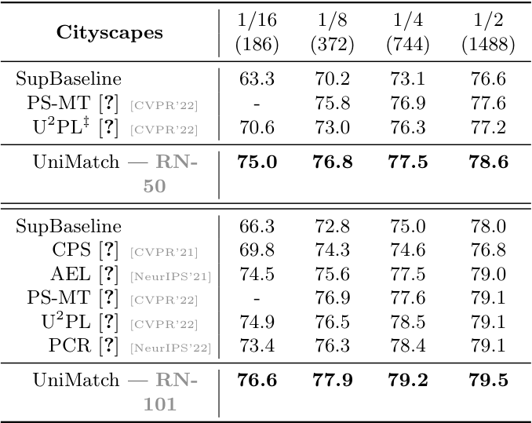

<i>表3：Cityscapes 上不同标注比例、ResNet-50/101 的 mIoU 对比。</i>

#### MS COCO

COCO 数据集由 118k/5k 训练/验证图像组成，是一个相当具有挑战性的基准，包含 81 个类别需要预测。因此，在分割的半监督工作中很少被探索。然而，考虑到 Pascal 和 Cityscapes 上看似饱和的性能，作者认为在这个数据集上评估算法将更加实用。作者采用与 PseudoSeg 完全相同的设置和骨干网络（Xception-65）。如下表所示，UniMatch 显著超越了所有可用方法 1.4%-4.5%。

  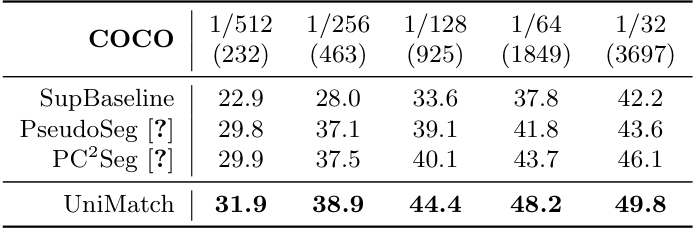

<i>表4：MS COCO 上半监督语义分割 mIoU 结果（Xception-65）。</i>

### 3.3 消融研究

除非另有说明，作者主要在 Pascal 数据集上使用 ResNet-101 进行广泛的消融研究。

#### 对 FixMatch 基线的改进

在三个基准测试中分别进行了最重要的消融研究。很明显，UniMatch 一致地大幅改进了强基线。

#### UniPerb 和 DusPerb 的个体有效性

首先证明了复现的 FixMatch 是对先前 SOTA 方法的强大竞争者。然后基于 FixMatch，UniPerb 和 DusPerb 都大幅促进了这个基线。最后，集成两个组件的整体 UniMatch 取得了最佳结果。

  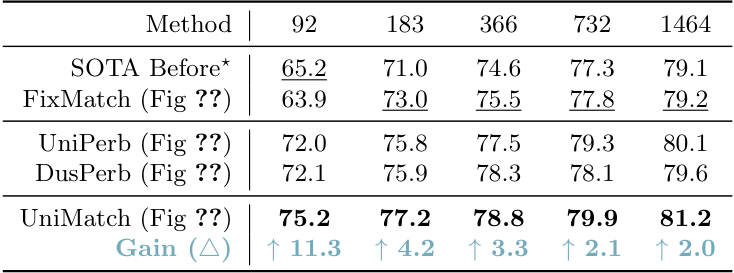

<i>表5：FixMatch 基线、UniPerb、DusPerb、UniMatch 在 Pascal 上的消融（不同标注数量）。</i>

  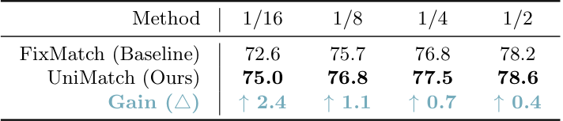

<i>表6：Cityscapes 上 UniMatch 与 FixMatch 的对比。</i>

  

<i>表7：COCO 上 UniMatch 与 FixMatch 的对比。</i>

#### 多样化扰动的改进是非平凡的

UniMatch 利用三个视图，即一个特征扰动视图和两个图像扰动视图。作者希望验证构建多样化扰动是有益的，比盲目维护三个并行图像扰动要好得多。因此，作者设计了一个简单的对应方法，采用三个图像级强扰动视图。如下表所示，UniMatch 一致地优于它，表明 UniMatch 带来的改进不是由于盲目增加视图，而是多样性起作用。

  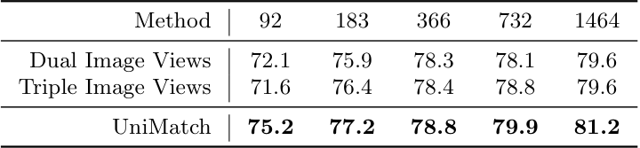

<i>表8：三视图多样化扰动 vs 三个图像级强扰动视图的消融。</i>

#### 双流扰动的改进是非平凡的

在 DusPerb 中，每个 mini-batch 中未标注图像的数量是加倍的，因为每个未标注图像被强扰动两次。因此，可能会认为改进是由于更大的批次大小。考虑到这个担忧，作者进一步对 FixMatch 进行了消融研究，使用两倍大的批次大小（保持相同的训练迭代）或两倍长的训练 epoch。如下表所示，尽管增加未标注批次大小或延长训练 epoch 在大多数情况下改进了 FixMatch 基线，但它们仍然明显落后于 DusPerb。

  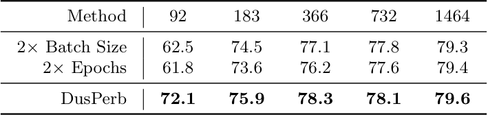

<i>表9：双流扰动 vs 两倍未标注 batch / 两倍训练 epoch 的消融。</i>

#### 将图像级和特征级扰动分离到独立流的必要性

PS-MT 将三个级别的扰动混合到单个前向流中，然而，作者声称将不同属性的扰动分离到独立流中将使模型更直接地实现目标不变性，并避免单个流过于困难。为了确认这一点，作者在**强**扰动图像的特征上注入 dropout，形成混合视图流。如下表所示，一个混合视图不如一个图像扰动视图。此外，作者尝试采用两个混合视图，但它仍然比 UniPerb 中的分离实践更差。

  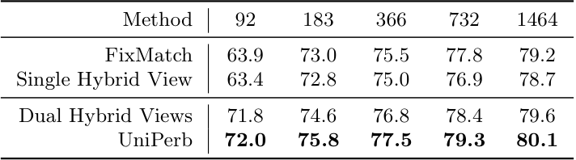

<i>表10：图像/特征扰动分离为独立流 vs 混合单流的消融。</i>

#### 更多扰动流

作者还尝试增加图像级和特征级扰动流的数量。观察到，增加扰动流不一定导致更高的性能。这也表明，UniMatch 中的两个图像流和一个特征流已经表现足够好。

  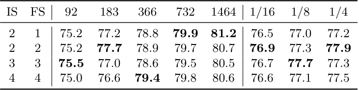

<i>表11：扰动流数量（图像流/特征流）的消融。</i>

#### 其他特征扰动策略

作者在方法中使用最简单的特征扰动形式，即通道 dropout。还有一些其他选项可用，如均匀噪声和虚拟对抗训练（VAT）。作者遵循相关工作来设置这些策略中的超参数。所有这些选项在图中进行了比较。可以得出结论，通道 dropout 表现最好。

  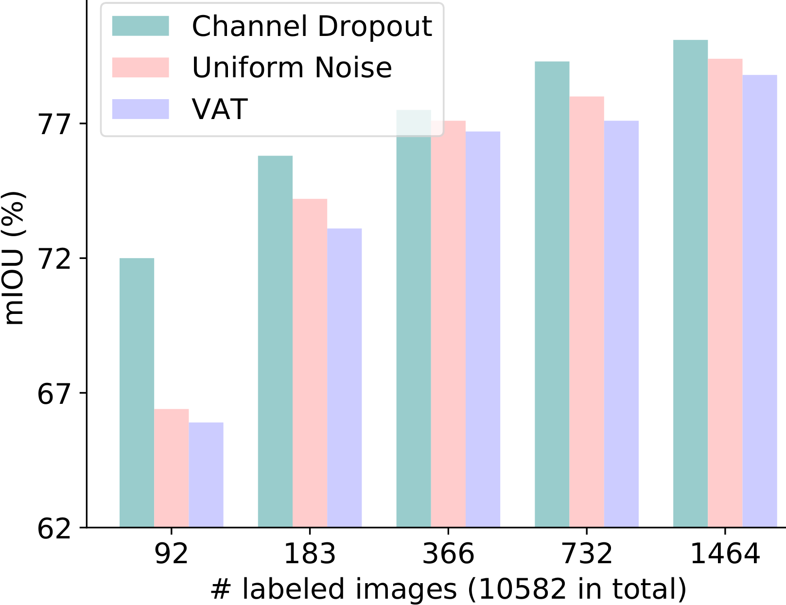

<i>图4：UniPerb 中不同特征扰动策略（通道 dropout、均匀噪声、VAT 等）的消融比较。</i>

#### 置信度阈值 $\tau$ 的值

作者在 Pascal 上对这个超参数进行了消融研究。观察到 $\tau$ 为 0.95 对 Pascal 效果最好。

  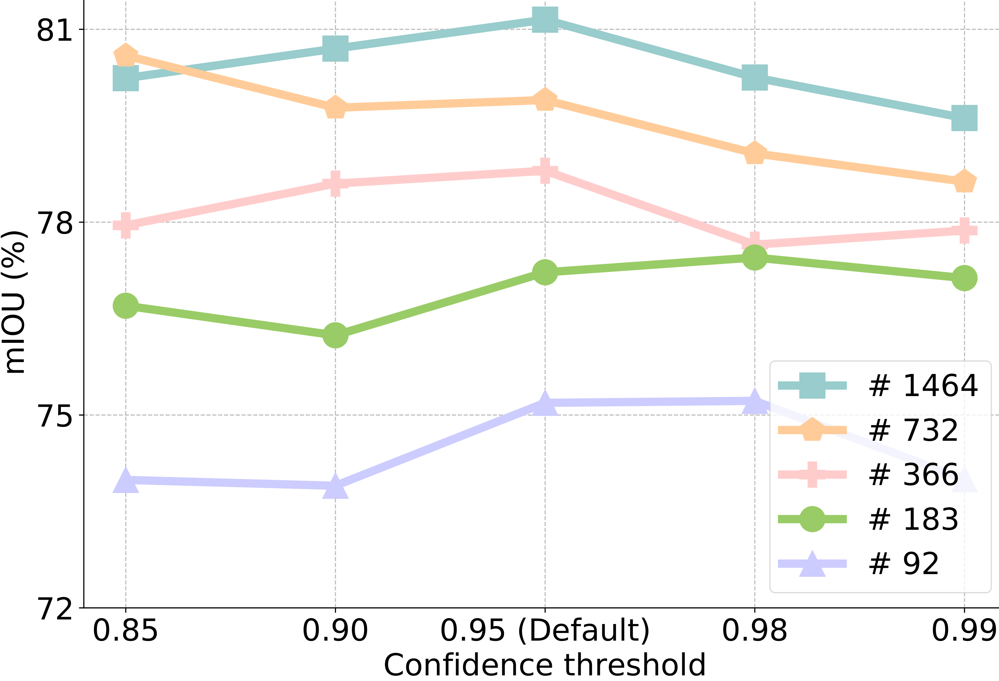

<i>图5：Pascal 数据集上置信度阈值 τ 的消融，图例数字表示标注图像数量。</i>

#### 插入特征扰动的位置

特征扰动注入在编码器和解码器的交汇处。先前的工作也在最终分类器的输入上执行扰动。作者比较了两个位置。如下表所示，编码器-解码器交汇处更好。

  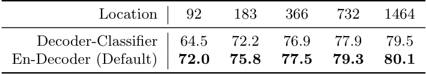

<i>表12：特征扰动插入位置（编码器-解码器交汇 vs 分类器输入）的消融。</i>

### 3.4 在更多分割场景中的应用

作者已经在自然图像的常见基准上验证了 UniMatch。在这里，作者进一步在两个高度实用和关键的场景中进行额外实验，即遥感解释和医学图像分析。在这两个场景中，未标注数据容易且廉价获得，而手动标注极其昂贵。

#### 遥感解释

作者专注于该场景中的变化检测任务，因为其广泛的应用需求和严格的标注要求。给定一对双时相图像，即同一区域但不同时间的两张图像，需要突出显示变化的区域。它可以简单地被视为二进制分割问题。典型框架如下图所示。

  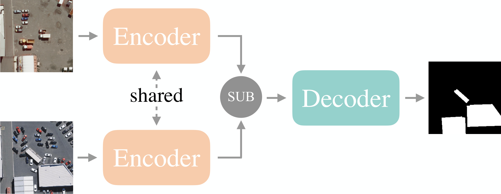

<i>图6：变化检测任务中的典型框架，编码器提取的特征做差后送入解码器。</i>

遵循最新工作 SemiCD，作者在两个流行基准上验证了 UniMatch，即 WHU-CD 和 LEVIR-CD。作者尝试了两个网络，即 PSPNet 和 DeepLabv3+，都基于 ResNet-50。如下表所示，UniMatch 显著优于 SemiCD。

  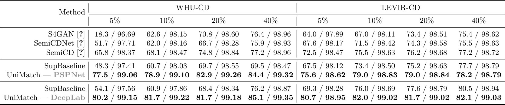

<i>表13：变化检测基准 WHU-CD、LEVIR-CD 上 SemiCD 与 UniMatch 的对比。</i>

#### 医学图像分析

作者遵循最近的工作来研究 ACDC 数据集上的半监督医学图像分割。如下表所示，UniMatch 显著改进了 SOTA，例如，给定 3 个标注案例时 +23.3%。仅使用 1 个标注案例的结果甚至超过了使用 3 个案例的其他方法，并与使用 7 个案例的其他方法相当。

  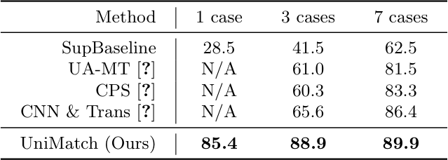

<i>表14：ACDC 心脏 MRI 半监督分割结果（不同标注病例数）。</i>

